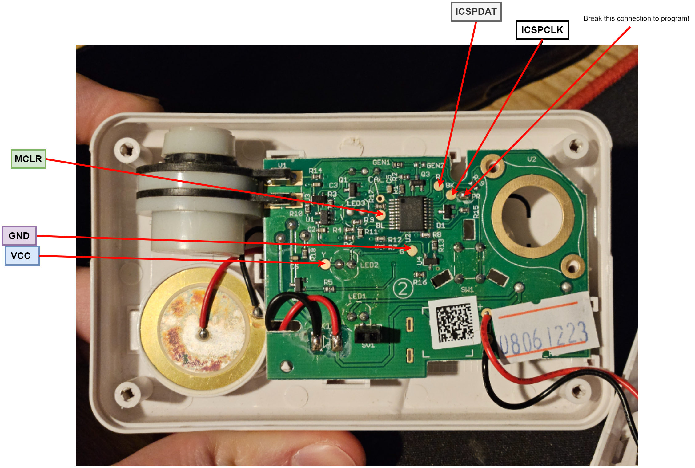

# Custom firmware for the First Alert CO-FA-9B Carbon Monoxide Alarm

Free time and curiosity appear to have got the better of me. 
One of my Carbon Monoxide alarms was faulty and we all know what that means - disassembly time. 
I was gleeful to discover that the First Alert CO-FA-9B features a Microchip PIC16F677 microcontroller and a number of test points allowing the device to be reprogrammed with a PICkit programmer. 

I simply could not resist the temptation to write a custom firmware for this device to make it play a tune.
When the button is held, the piezo will play back a MIDI file embedded into the FLASH.
In this demo the song is All Star by Smashmouth.

# Programming Instructions
Connect PICkit programmer to pads on the PCB as shown in the photo.
The solder link next to the ICSP clock pin marked "PR" must be broken otherwise programming will fail.



Either compiler and flash the [project](project/first-alert.X/) with MPLAB X IDE or download the binary and flash with MPLAB IPE.

**DISCLAIMER:** This will overwrite the original firmware on the MCU and the device will no longer function as a Carbon Monoxide Alarm.
Readout protection is enabled on the MCU so it is not possible to make a backup of the original firmware binary.

# MIDI Analyser

To load a custom MIDI file, a python script [midi-analyser.py](tools/midi-analyser.py) is provided to convert a midi file to an array which can be interpreted by the application.

Usage:

``` sh
# Navigate to the tools directory
cd tools

# Create python virtual environment
python3 -m venv env

# Start python virtual environment
source env/bin/activate

# Install dependencies
pip install -r requirements.txt

# Run script on midi file (note: replace .mid file with your own file)
python3 midi-analyser.py -f ../resources/smashmouth-all-star.mid
```

The script will print information about each midi note on a new line.

The reg value represents the 16-bit value that must be loaded into the Timer1 register to play a note of the correct frequency.
The start and end values are millisecond timestamps denoting the start and end of the note relative to the start of playback.

Copy the reg, start and end values into the lookup table in [main.c](project/first-alert.X/main.c), ensuring the size is adjusted accordingly to match the number of notes in the lookup table.

``` c
#define NOTE_COUNT  0 /* number of LUT entries */
const note_def_t song_lut[NOTE_COUNT] = {
    /* 
        {reg value, start time, end time},
        ...
        ...
    */
}
```